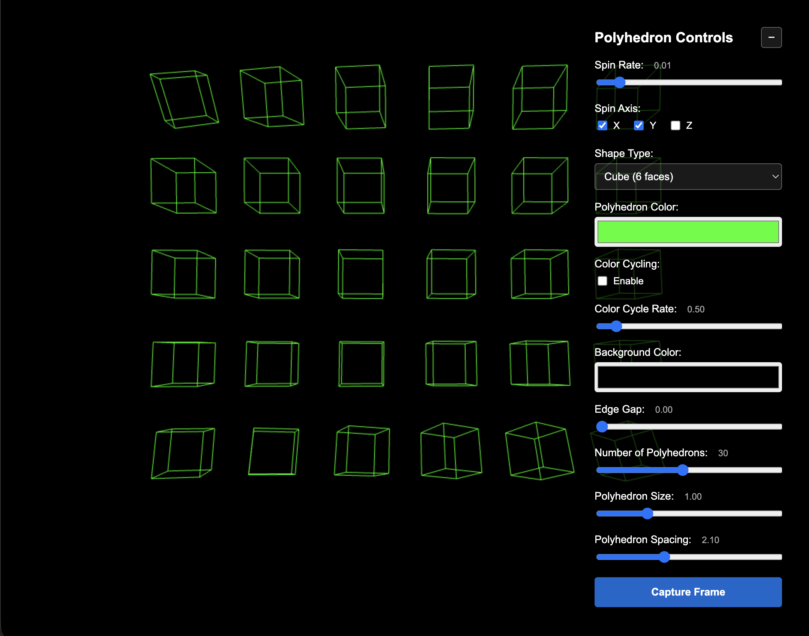

# Three.js Wireframe Polyhedron

An interactive 3D visualization application featuring customizable wireframe polyhedrons built with Three.js. Control multiple spinning 3D shapes with real-time parameter adjustments through an intuitive web interface.



## Features

- **Multiple Polyhedron Types**: Choose from five different geometric shapes:
  - Tetrahedron (4 faces)
  - Cube (6 faces)
  - Octahedron (8 faces)
  - Dodecahedron (12 faces)
  - Icosahedron (20 faces)

- **Real-time Controls**:
  - Adjustable spin rate and axis (X, Y, Z)
  - Customizable polyhedron and background colors
  - Color cycling animation with adjustable rate
  - Edge gap control for vertex visibility
  - Dynamic polyhedron count (1-64)
  - Size and spacing adjustments
  - Frame capture functionality

- **Multi-Polyhedron Grid**: Display multiple polyhedrons arranged in an auto-calculated grid pattern

- **Responsive Design**: Automatically adapts to window resizing

## Dependencies

- **[Three.js](https://threejs.org/)** (v0.180.0) - 3D graphics library
- **[Vite](https://vitejs.dev/)** (v7.1.10) - Build tool and development server

## Installation

1. Clone the repository:
```bash
git clone <repository-url>
cd threejs
```

2. Install dependencies:
```bash
npm install
```

## Running the Application

### Development Mode

Start the development server with hot module reloading:

```bash
npm run dev
```

The application will be available at `http://localhost:5173/` (default Vite port).

### Production Build

Create an optimized production build:

```bash
npm run build
```

The build output will be in the `dist/` directory.

### Preview Production Build

Test the production build locally:

```bash
npm run preview
```

## How to Use

1. Open the application in your web browser
2. Use the control panel on the right side to adjust parameters:
   - **Spin Rate**: Control rotation speed (0 to 0.1)
   - **Spin Axis**: Toggle X, Y, Z axis rotation
   - **Shape Type**: Select polyhedron geometry
   - **Polyhedron Color**: Choose wireframe color
   - **Color Cycling**: Enable animated color transitions
   - **Background Color**: Change scene background
   - **Edge Gap**: Create gaps in edges to reveal vertices (0 to 0.3)
   - **Number of Polyhedrons**: Add multiple shapes (1-64)
   - **Polyhedron Size**: Scale individual shapes (0.3 to 3)
   - **Polyhedron Spacing**: Adjust distance between shapes (0.5 to 5)
3. Click **Capture Frame** to save the current view as an image
4. Use the minimize button (−) to collapse the control panel

## Project Structure

```
threejs/
├── index.html       # Entry point with UI controls and styling
├── main.js          # Three.js scene setup and animation logic
├── package.json     # Project dependencies and scripts
└── README.md        # This file
```

## Architecture

- **Scene Setup**: Uses Three.js PerspectiveCamera and WebGLRenderer
- **Geometry Generation**: Procedurally generates wireframe polyhedrons from vertices and edges
- **Multi-Shape Grid**: Automatically positions multiple polyhedrons in a centered 2D grid pattern
- **Animation Loop**: Handles real-time rotation and rendering at 60 FPS
- **No Framework**: Pure vanilla JavaScript with ES6 modules

## Browser Compatibility

Works in all modern browsers with WebGL support:
- Chrome/Edge (recommended)
- Firefox
- Safari
- Opera

## License

ISC

## Author

Andy Park
